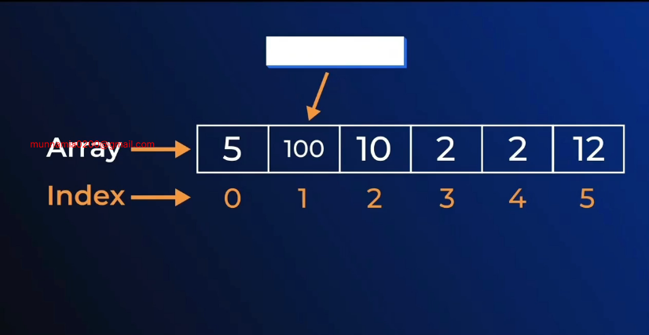
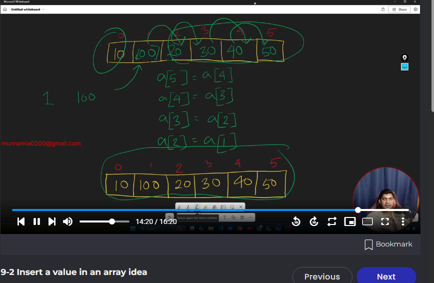
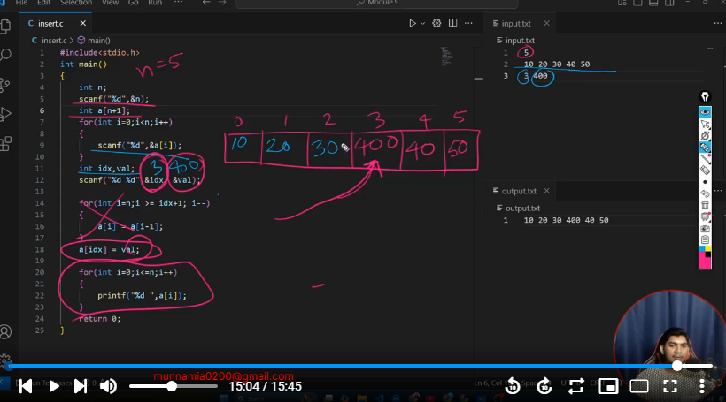
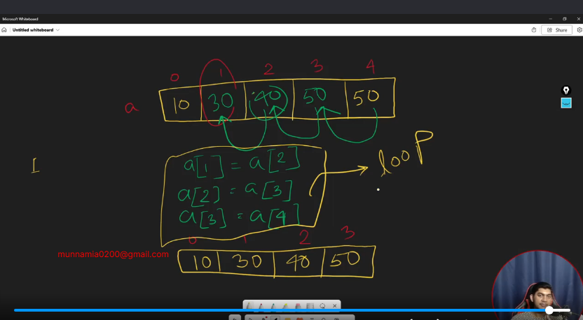
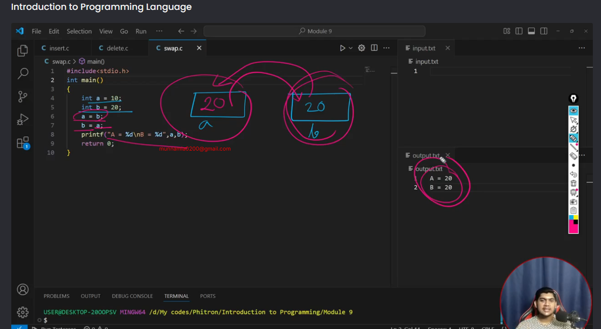
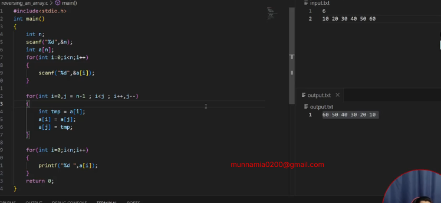

# M-9 Array-Operation-in-c



## 9-2 Insert a value in an array idea



```c
 #include<stdio.h>
 int main()
 {
     int n;
     scanf("%d",&n);
     int a[n+1];
     for (int i = 0; i <n; i++)
     {
     scanf("%d",&a[i]);
     }
     int idx,val;
     scanf("%d %d",&idx,&val);
     for (int i = n; i >=idx+1; i--)
     {
        a[i]=a[i-1];
     }
     a[idx]=val;
     for (int i = 0; i <=n; i++)
     {
        printf("%d ",a[i]);
     }
     
     
     return 0;
 }
 ```

 

## 9-5 Removing a value in an array idea

 

 ## 9-6 Removing a value in an array Implementation

 ```c
 #include<stdio.h>
int main()
{
    int n;
    scanf("%d",&n);
    int a[n];
    for (int i = 0; i < n; i++)
    {
       scanf("%d",&a[i]);
    }
    int idx;
    scanf("%d",&idx);
         for (int i = idx; i<n-1; i++)
     {
        a[i]=a[i+1];
     }
    n--;
     for (int i = 0; i <n; i++)
     {
        printf("%d ",a[i]);
     }
    return 0;
}
```
## 9-7 Swapping two values

❌


```c
#include<stdio.h>
int main()
{
    int a=10;
    int b=20;
    int tmp=a;
    a=b;
    b=tmp;
    printf("%d\n%d",a,b); 
    return 0;
}
```

## 9-9 Reverse an array
```c
#include<stdio.h>
int main()
{
    int n;
    scanf("%d",&n);
    int a[n];
    for (int i = 0; i < n; i++)
    {
       scanf("%d",&a[i]);
    }

    int i=0;
    int j = n-1;
    while (i<j)
    {
  int tmp=a[i];
  a[i]=a[j];
  a[j]=tmp;
  i++;
  j--;
    }
for (int i = 0; i < n; i++)
{
    printf("%d ",a[i]);
}

    
    
    return 0;
}
```
- use for loop 
